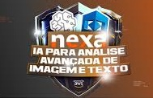

<audio controls>
<source src="output/podcast-editado.mp3" type="audio/mpeg">
</audio>

# "Nexa - Análise Avançada de Imagens e Texto com IA na AWS" na plataforma da [DIO](https://dio.me)

## Módulo "Construindo Diálogos na AWS".

### Desafios de Projeto: 

["Transcrevendo uma imagem em Texto com AWS Textract"](./ocr-textract/)

["AWS Rekognition - Detectando Celebridades em Imagens"](./ocr-celebridades/)

Deixe a dificuldade de integrar suas APIS com AI bem de lado com o SageMaker Canvas!

Use modelos pré-treinados de IA para realizar análises, transcrições e sintetizações de voz, texto e imagens de forma automática com o SageMaker Canvas, da AWS, o maior playground de modelos pré-treinados para integrações mais fáceis e bem-sucedidas.

## 👨‍💻 Autor

    
    
&nbsp&nbsp&nbspMaurício Barros 
    &nbsp&nbsp&nbsp
    <a href="https://github.com/opusvix">
    GitHub</a>&nbsp;|&nbsp;
    <a href="https://www.linkedin.com/in/mauriciodasilvabarros/">LinkedIn</a>
    &nbsp;|&nbsp;
    <a href="https://x.com/opusvix">
    X</a>
&nbsp;|&nbsp;

  

---

:hammer_and_wrench: com :sparkling_heart: por [Maurício Barros](https://github.com/opusvix)
